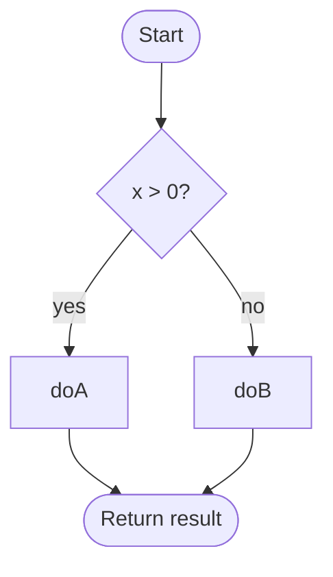
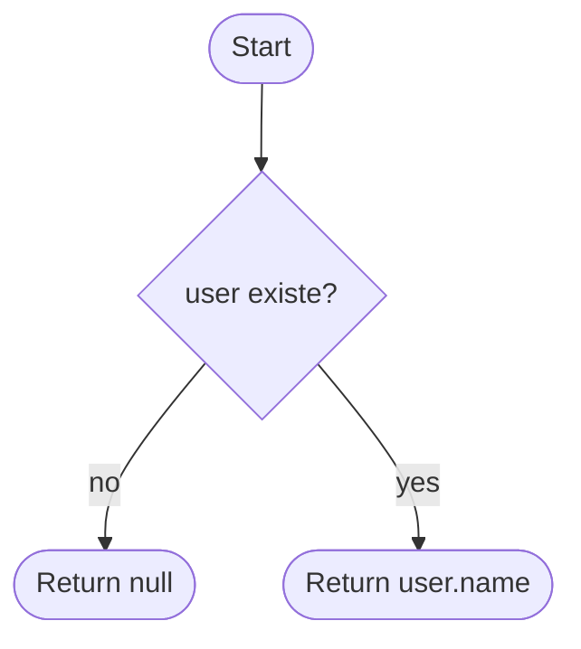
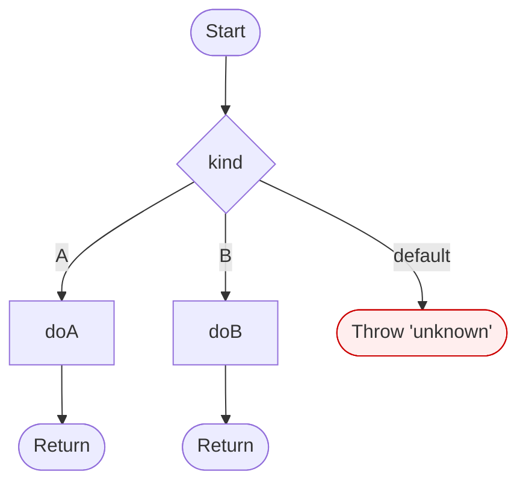
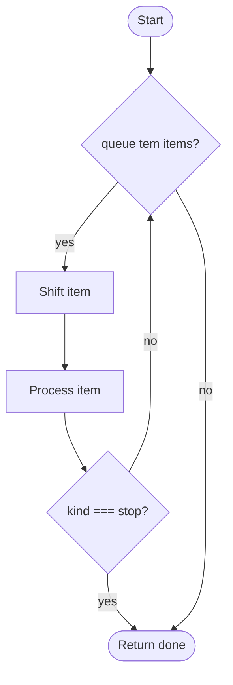
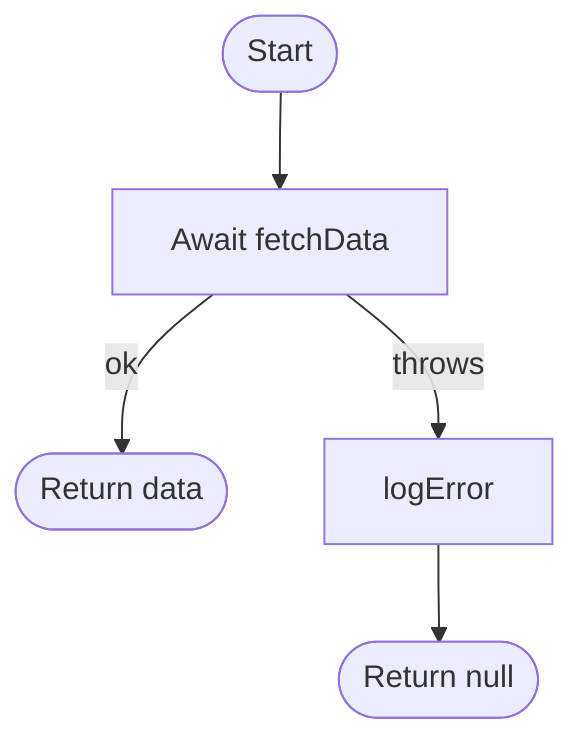
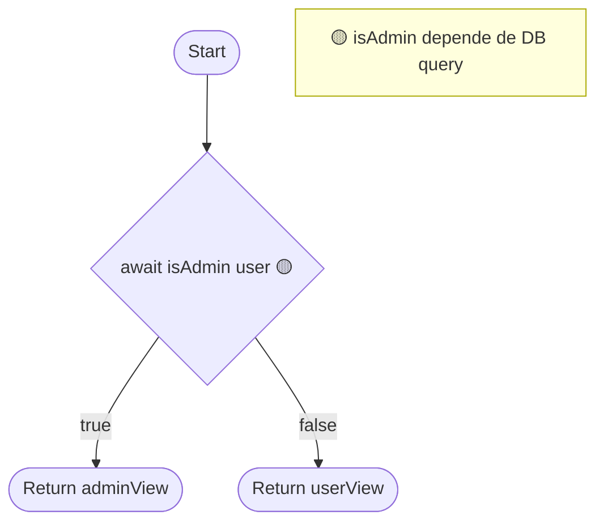
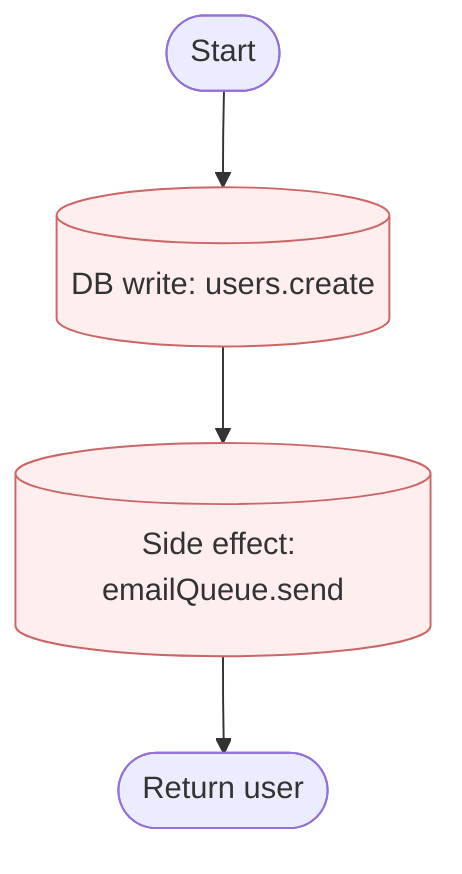

# W3 — Schemas + Agents Implementation Plan

> **For agentic workers:** REQUIRED SUB-SKILL: Use superpowers:subagent-driven-development (recommended) or superpowers:executing-plans to implement this plan task-by-task. Steps use checkbox (`- [ ]`) syntax for tracking.

**Goal:** Implementar (1) `tasks.json` per-feature + render bidirecional com `00-overview.md`; (2) `sources.json` + `claims.json` per-pesquisa + render com `pesquisa.md` (com confidence markers estruturais); (3) 3 agents opt-in (db-archaeologist, screenshot-spec-writer, flowchart-extractor) instaláveis via `xp-stack add-skill <name>`.

**Architecture:** Camadas: T14+T15 são código JS (lib + tests, padrão markdown-tasks de W2). T16-T18 são SKILL.md files em `templates/opt-in-skills/<agent>/` (estilo Reversa: frontmatter + corpo + references/). T16-T18 não introduzem JS novo — usam o subcomando `xp-stack add-skill` (W1 T7) pra instalação. Tests pra agents são smoke-test (validam que `add-skill` instala corretamente o pacote).

**Tech Stack:** Mesma do W0+W1+W2 (Node 18+ ESM, vitest, ajv). Sem novas deps. Schemas `tasks.schema.json`, `sources.schema.json`, `claims.schema.json` já existem (W0). Pattern de render reusa `markdown-tasks.js` (W2 T13) onde aplicável.

---

## File Structure

| Path | Tipo | Responsabilidade |
|------|------|------------------|
| `src/lib/tasks.js` | Create (T14) | Read/write `docs/tasks/{feature}/tasks.json` com schema validation; sync com state.json |
| `src/lib/research.js` | Create (T15) | Read/write `docs/pesquisas/{slug}/{sources,claims}.json` com schema validation |
| `src/lib/research-renderer.js` | Create (T15) | Gera/atualiza `pesquisa.md` a partir de claims+sources com inline citations [S1], [S2] + confidence markers |
| `templates/opt-in-skills/db-archaeologist/SKILL.md` | Create (T16) | Skill markdown — analisa Supabase migrations + RLS + schemas |
| `templates/opt-in-skills/db-archaeologist/references/output-schema.md` | Create (T16) | Schema esperado de output: `database/{schema.json, rls-matrix.json, migrations-timeline.md}` |
| `templates/opt-in-skills/screenshot-spec-writer/SKILL.md` | Create (T17) | Skill markdown — recebe screenshot, gera spec UI |
| `templates/opt-in-skills/screenshot-spec-writer/references/output-template.md` | Create (T17) | Template do output `docs/specs/ui/{screen}.md` |
| `templates/opt-in-skills/flowchart-extractor/SKILL.md` | Create (T18) | Skill markdown — recebe arquivo + função, gera Mermaid flowchart |
| `templates/opt-in-skills/flowchart-extractor/references/mermaid-patterns.md` | Create (T18) | Patterns Mermaid pra fluxo de controle (if/loop/throw/return) |
| `tests/lib/tasks.test.js` | Create (T14) | Tests do tasks helper |
| `tests/lib/research.test.js` | Create (T15) | Tests do research helper |
| `tests/lib/research-renderer.test.js` | Create (T15) | Tests do renderer (inline citations + confidence) |
| `tests/integration/agents-install.test.js` | Create (T16+T17+T18 final) | Smoke test único: `add-skill <agent>` instala corretamente os 3 agents |

---

## Convenções gerais (válidas pra W3)

- TDD obrigatório em T14+T15 (JS code). Pra T16-T18, TDD é "test que add-skill instala SKILL.md + references" — escrito uma vez no fim.
- Tests usam `execFileSync` (sem shell, regra W0).
- Fixtures em `/tmp/xp-stack-w3-{taskname}-{rand}/` com cleanup em afterEach.
- Mensagens em PT-BR, subjects ≤72 chars, sem `Co-Authored-By`.
- T16-T18 SKILL.md files seguem pattern Reversa: frontmatter (name/description/allowed-tools) + persona ("Você é o X") + processo numerado + output schema em references/.
- Confidence markers (🟢/🟡/🔴) estruturais em outputs JSON dos agents (declaração obrigatória nas SKILL.md).

---

## Task 14: lib `tasks.js` — read/write tasks.json per-feature

**Files:**
- Create: `src/lib/tasks.js`
- Create: `tests/lib/tasks.test.js`

> **Trade-off vs state.js (W2):** state.json continua sendo workflow tracker minimalista (current_task, phase, blockers, checkpoints). tasks.json é metadata-rica (id, slug, title, deps, owner, pr, confidence, status). **Sync rule:** state.tasks_completed ↔ tasks.json onde status='done'. Atualizar via lib que mantém ambos consistentes — fora do scope T14, fica pra T19+ (refactor sync).
>
> Pra T14: cria-se a fundação (read/write/validate). Sync com state vem em iteration futura.

- [ ] **Step 1: Escrever teste falho**

```bash
mkdir -p /home/rnobre/dev/xp-stack/tests/lib
```

Criar `tests/lib/tasks.test.js`:

```javascript
import { describe, it, expect, beforeEach, afterEach } from 'vitest';
import { mkdtempSync, mkdirSync, rmSync } from 'node:fs';
import { tmpdir } from 'node:os';
import { join } from 'node:path';
import {
  readTasks,
  writeTasks,
  EMPTY_TASKS,
  upsertTask,
  setTaskStatus,
} from '../../src/lib/tasks.js';

describe('tasks - EMPTY_TASKS', () => {
  it('cria tasks struct vazio valido contra schema', () => {
    const t = EMPTY_TASKS('feature-x');
    expect(t.schema_version).toBe('1.0');
    expect(t.feature).toBe('feature-x');
    expect(t.tasks).toEqual([]);
  });
});

describe('tasks - read/write', () => {
  let tmp, featureDir;

  beforeEach(() => {
    tmp = mkdtempSync(join(tmpdir(), 'xp-stack-tasks-test-'));
    featureDir = join(tmp, 'docs', 'tasks', 'feature-x');
    mkdirSync(featureDir, { recursive: true });
  });

  afterEach(() => {
    rmSync(tmp, { recursive: true, force: true });
  });

  it('writeTasks persiste e readTasks le de volta', () => {
    const t = EMPTY_TASKS('feature-x');
    t.tasks.push({
      id: 'T1', slug: 'primeira', title: 'Primeira task',
      status: 'pending', deps: [], phase: 'fundacao', confidence: '🟢',
    });
    writeTasks(featureDir, t);

    const read = readTasks(featureDir);
    expect(read).toEqual(t);
  });

  it('readTasks retorna null se nao existe', () => {
    expect(readTasks(featureDir)).toBeNull();
  });

  it('writeTasks valida contra schema antes de gravar', () => {
    const invalid = {
      schema_version: '1.0', feature: 'x',
      tasks: [{ id: 'T1', slug: 'x', title: 'x', status: 'in_orbit', deps: [], phase: 'fundacao', confidence: '🟢' }],
    };
    expect(() => writeTasks(featureDir, invalid)).toThrow();
  });
});

describe('tasks - upsertTask', () => {
  let tmp, featureDir;

  beforeEach(() => {
    tmp = mkdtempSync(join(tmpdir(), 'xp-stack-tasks-up-'));
    featureDir = join(tmp, 'docs', 'tasks', 'feature-x');
    mkdirSync(featureDir, { recursive: true });
    writeTasks(featureDir, EMPTY_TASKS('feature-x'));
  });

  afterEach(() => {
    rmSync(tmp, { recursive: true, force: true });
  });

  it('insere task nova', () => {
    upsertTask(featureDir, {
      id: 'T1', slug: 'primeira', title: 'P', status: 'pending',
      deps: [], phase: 'fundacao', confidence: '🟢',
    });
    const t = readTasks(featureDir);
    expect(t.tasks.length).toBe(1);
    expect(t.tasks[0].id).toBe('T1');
  });

  it('atualiza task existente (mesmo id)', () => {
    upsertTask(featureDir, {
      id: 'T1', slug: 'primeira', title: 'P', status: 'pending',
      deps: [], phase: 'fundacao', confidence: '🟢',
    });
    upsertTask(featureDir, {
      id: 'T1', slug: 'primeira', title: 'P', status: 'done',
      deps: [], phase: 'fundacao', confidence: '🟢',
    });
    const t = readTasks(featureDir);
    expect(t.tasks.length).toBe(1);
    expect(t.tasks[0].status).toBe('done');
  });
});

describe('tasks - setTaskStatus', () => {
  let tmp, featureDir;

  beforeEach(() => {
    tmp = mkdtempSync(join(tmpdir(), 'xp-stack-tasks-st-'));
    featureDir = join(tmp, 'docs', 'tasks', 'feature-x');
    mkdirSync(featureDir, { recursive: true });
    const t = EMPTY_TASKS('feature-x');
    t.tasks.push({
      id: 'T1', slug: 'p', title: 'P', status: 'pending',
      deps: [], phase: 'fundacao', confidence: '🟢',
    });
    writeTasks(featureDir, t);
  });

  afterEach(() => {
    rmSync(tmp, { recursive: true, force: true });
  });

  it('atualiza status de task existente', () => {
    setTaskStatus(featureDir, 'T1', 'done');
    const t = readTasks(featureDir);
    expect(t.tasks[0].status).toBe('done');
  });

  it('throw se task nao existe', () => {
    expect(() => setTaskStatus(featureDir, 'T99', 'done')).toThrow(/nao encontrada/i);
  });

  it('throw se status invalido', () => {
    expect(() => setTaskStatus(featureDir, 'T1', 'launched-to-mars')).toThrow();
  });
});
```

- [ ] **Step 2: Verificar FAIL** — `npx vitest run tests/lib/tasks.test.js`. Esperado: FAIL (módulo não existe).

- [ ] **Step 3: Implementar `src/lib/tasks.js`**

```bash
cat > /home/rnobre/dev/xp-stack/src/lib/tasks.js <<'EOF'
import { existsSync, mkdirSync, readFileSync, writeFileSync } from 'node:fs';
import { join, dirname } from 'node:path';
import { validate } from './validators.js';

const TASKS_FILE = 'tasks.json';

/**
 * Cria tasks struct inicial vazia.
 *
 * @param {string} featureSlug
 * @returns {object} Valido contra tasks.schema.json
 */
export function EMPTY_TASKS(featureSlug) {
  return {
    schema_version: '1.0',
    feature: featureSlug,
    tasks: [],
  };
}

/**
 * Le docs/tasks/{slug}/tasks.json.
 *
 * @param {string} featureDir - Path absoluto do diretorio da feature
 * @returns {object|null}
 */
export function readTasks(featureDir) {
  const path = join(featureDir, TASKS_FILE);
  if (!existsSync(path)) return null;
  return JSON.parse(readFileSync(path, 'utf8'));
}

/**
 * Escreve tasks.json. Valida contra schema antes.
 *
 * @param {string} featureDir
 * @param {object} tasks
 * @throws Error se invalido
 */
export function writeTasks(featureDir, tasks) {
  const result = validate('tasks', tasks);
  if (!result.valid) {
    throw new Error(`Tasks invalido contra schema:\n${JSON.stringify(result.errors, null, 2)}`);
  }
  const path = join(featureDir, TASKS_FILE);
  mkdirSync(dirname(path), { recursive: true });
  writeFileSync(path, JSON.stringify(tasks, null, 2) + '\n', 'utf8');
}

/**
 * Insere nova task ou atualiza existente (match por id).
 *
 * @param {string} featureDir
 * @param {object} task - Task object valido contra schema
 */
export function upsertTask(featureDir, task) {
  let t = readTasks(featureDir);
  if (!t) t = EMPTY_TASKS(task.feature ?? 'unknown');
  const idx = t.tasks.findIndex((x) => x.id === task.id);
  if (idx >= 0) {
    t.tasks[idx] = task;
  } else {
    t.tasks.push(task);
  }
  writeTasks(featureDir, t);
}

/**
 * Atualiza status de task existente. Throw se nao existe ou status invalido.
 *
 * @param {string} featureDir
 * @param {string} taskId
 * @param {string} newStatus - Um de: pending|in_progress|blocked|done|abandoned
 */
export function setTaskStatus(featureDir, taskId, newStatus) {
  const t = readTasks(featureDir);
  if (!t) throw new Error(`Tasks nao encontrado em ${featureDir}/tasks.json`);
  const task = t.tasks.find((x) => x.id === taskId);
  if (!task) throw new Error(`Task ${taskId} nao encontrada em tasks.json`);
  task.status = newStatus;
  writeTasks(featureDir, t); // schema validation rejeita status invalido
}
EOF
```

- [ ] **Step 4: Verificar PASS** — `npx vitest run tests/lib/tasks.test.js`. Esperado: 9 verde (1 EMPTY + 3 read/write + 2 upsertTask + 3 setTaskStatus).

- [ ] **Step 5: Commit T14**

```bash
cd /home/rnobre/dev/xp-stack
git add src/lib/tasks.js tests/lib/tasks.test.js
git commit -m "feat(lib): adiciona tasks.js read/write tasks.json per-feature (T14 W3)

Helper foundational pra schemas estruturados:
- EMPTY_TASKS(slug) cria tasks.json vazio
- readTasks/writeTasks com schema validation (tasks.schema.json, W0)
- upsertTask: insert ou update por id (sem duplicar)
- setTaskStatus: atualiza status (throw se task ou status invalido)

Reusa validate() de validators.js (W0).
Sync com state.json deferido pra refactor futuro.

Tests: 9/9 verde."
git push origin feat/v1.0.0-ship
```

---

## Task 15: lib `research.js` + `research-renderer.js` — sources/claims.json + render

**Files:**
- Create: `src/lib/research.js`
- Create: `src/lib/research-renderer.js`
- Create: `tests/lib/research.test.js`
- Create: `tests/lib/research-renderer.test.js`

> **Comportamento esperado:** sources.json é array de fontes citadas (`[{id, url, title, type, accessed_at, hash}]`); claims.json é array de afirmações com confidence (`[{id, statement, sources: [...], confidence, reviewed_by_critic}]`). Renderer gera `pesquisa.md` com inline citations `[S1]` e confidence markers `🟢🟡🔴` ao final de cada claim.

- [ ] **Step 1: Escrever teste falho de research.js**

Criar `tests/lib/research.test.js`:

```javascript
import { describe, it, expect, beforeEach, afterEach } from 'vitest';
import { mkdtempSync, mkdirSync, rmSync } from 'node:fs';
import { tmpdir } from 'node:os';
import { join } from 'node:path';
import {
  readSources,
  writeSources,
  readClaims,
  writeClaims,
  EMPTY_SOURCES,
  EMPTY_CLAIMS,
  addSource,
  addClaim,
} from '../../src/lib/research.js';

describe('research - EMPTY_SOURCES / EMPTY_CLAIMS', () => {
  it('retornam arrays vazios', () => {
    expect(EMPTY_SOURCES()).toEqual([]);
    expect(EMPTY_CLAIMS()).toEqual([]);
  });
});

describe('research - read/write sources', () => {
  let tmp, slugDir;

  beforeEach(() => {
    tmp = mkdtempSync(join(tmpdir(), 'xp-stack-research-test-'));
    slugDir = join(tmp, 'docs', 'pesquisas', 'estudo-x');
    mkdirSync(slugDir, { recursive: true });
  });

  afterEach(() => {
    rmSync(tmp, { recursive: true, force: true });
  });

  it('writeSources + readSources roundtrip', () => {
    const sources = [
      { id: 'S1', url: 'https://example.com', title: 'Ex', type: 'official_docs', accessed_at: '2026-05-03', hash: 'sha256:abc' },
    ];
    writeSources(slugDir, sources);
    expect(readSources(slugDir)).toEqual(sources);
  });

  it('readSources retorna null se nao existe', () => {
    expect(readSources(slugDir)).toBeNull();
  });

  it('writeSources valida contra schema (rejeita url invalida)', () => {
    const invalid = [{ id: 'S1', url: 'not-a-url', title: 't', type: 'official_docs', accessed_at: '2026-05-03', hash: 'x' }];
    expect(() => writeSources(slugDir, invalid)).toThrow();
  });
});

describe('research - read/write claims', () => {
  let tmp, slugDir;

  beforeEach(() => {
    tmp = mkdtempSync(join(tmpdir(), 'xp-stack-research-claims-'));
    slugDir = join(tmp, 'docs', 'pesquisas', 'estudo-x');
    mkdirSync(slugDir, { recursive: true });
  });

  afterEach(() => {
    rmSync(tmp, { recursive: true, force: true });
  });

  it('writeClaims + readClaims roundtrip', () => {
    const claims = [
      { id: 'C1', statement: 'X eh verdade', sources: ['S1'], confidence: '🟢', reviewed_by_critic: true },
    ];
    writeClaims(slugDir, claims);
    expect(readClaims(slugDir)).toEqual(claims);
  });

  it('writeClaims valida (confidence fora do enum)', () => {
    const invalid = [{ id: 'C1', statement: 'x', sources: ['S1'], confidence: 'maybe', reviewed_by_critic: false }];
    expect(() => writeClaims(slugDir, invalid)).toThrow();
  });
});

describe('research - addSource/addClaim helpers', () => {
  let tmp, slugDir;

  beforeEach(() => {
    tmp = mkdtempSync(join(tmpdir(), 'xp-stack-research-add-'));
    slugDir = join(tmp, 'docs', 'pesquisas', 'estudo-x');
    mkdirSync(slugDir, { recursive: true });
  });

  afterEach(() => {
    rmSync(tmp, { recursive: true, force: true });
  });

  it('addSource adiciona ao array existente', () => {
    addSource(slugDir, { id: 'S1', url: 'https://a.com', title: 'A', type: 'official_docs', accessed_at: '2026-05-03', hash: 'sha256:1' });
    addSource(slugDir, { id: 'S2', url: 'https://b.com', title: 'B', type: 'blog_post', accessed_at: '2026-05-03', hash: 'sha256:2' });
    const s = readSources(slugDir);
    expect(s.length).toBe(2);
    expect(s[1].id).toBe('S2');
  });

  it('addClaim adiciona ao array existente', () => {
    addSource(slugDir, { id: 'S1', url: 'https://a.com', title: 'A', type: 'official_docs', accessed_at: '2026-05-03', hash: 'sha256:1' });
    addClaim(slugDir, { id: 'C1', statement: 'foo', sources: ['S1'], confidence: '🟡', reviewed_by_critic: false });
    const c = readClaims(slugDir);
    expect(c.length).toBe(1);
    expect(c[0].id).toBe('C1');
  });
});
```

- [ ] **Step 2: Verificar FAIL** — `npx vitest run tests/lib/research.test.js`.

- [ ] **Step 3: Implementar `src/lib/research.js`**

```bash
cat > /home/rnobre/dev/xp-stack/src/lib/research.js <<'EOF'
import { existsSync, mkdirSync, readFileSync, writeFileSync } from 'node:fs';
import { join, dirname } from 'node:path';
import { validate } from './validators.js';

const SOURCES_FILE = 'sources.json';
const CLAIMS_FILE = 'claims.json';

export function EMPTY_SOURCES() { return []; }
export function EMPTY_CLAIMS() { return []; }

export function readSources(slugDir) {
  const path = join(slugDir, SOURCES_FILE);
  if (!existsSync(path)) return null;
  return JSON.parse(readFileSync(path, 'utf8'));
}

export function writeSources(slugDir, sources) {
  const result = validate('sources', sources);
  if (!result.valid) {
    throw new Error(`Sources invalido contra schema:\n${JSON.stringify(result.errors, null, 2)}`);
  }
  const path = join(slugDir, SOURCES_FILE);
  mkdirSync(dirname(path), { recursive: true });
  writeFileSync(path, JSON.stringify(sources, null, 2) + '\n', 'utf8');
}

export function readClaims(slugDir) {
  const path = join(slugDir, CLAIMS_FILE);
  if (!existsSync(path)) return null;
  return JSON.parse(readFileSync(path, 'utf8'));
}

export function writeClaims(slugDir, claims) {
  const result = validate('claims', claims);
  if (!result.valid) {
    throw new Error(`Claims invalido contra schema:\n${JSON.stringify(result.errors, null, 2)}`);
  }
  const path = join(slugDir, CLAIMS_FILE);
  mkdirSync(dirname(path), { recursive: true });
  writeFileSync(path, JSON.stringify(claims, null, 2) + '\n', 'utf8');
}

export function addSource(slugDir, source) {
  const list = readSources(slugDir) ?? EMPTY_SOURCES();
  list.push(source);
  writeSources(slugDir, list);
}

export function addClaim(slugDir, claim) {
  const list = readClaims(slugDir) ?? EMPTY_CLAIMS();
  list.push(claim);
  writeClaims(slugDir, list);
}
EOF
```

- [ ] **Step 4: Verificar PASS de research.test** — `npx vitest run tests/lib/research.test.js`. Esperado: 8 verde.

- [ ] **Step 5: Escrever teste falho de research-renderer**

Criar `tests/lib/research-renderer.test.js`:

```javascript
import { describe, it, expect } from 'vitest';
import { renderResearchMarkdown } from '../../src/lib/research-renderer.js';

describe('research-renderer', () => {
  const sources = [
    { id: 'S1', url: 'https://example.com/a', title: 'Source A', type: 'official_docs', accessed_at: '2026-05-03', hash: 'sha256:1' },
    { id: 'S2', url: 'https://example.com/b', title: 'Source B', type: 'blog_post', accessed_at: '2026-05-03', hash: 'sha256:2' },
  ];

  const claims = [
    { id: 'C1', statement: 'X eh verdade comprovada', sources: ['S1'], confidence: '🟢', reviewed_by_critic: true },
    { id: 'C2', statement: 'Y eh inferido por padrao', sources: ['S1', 'S2'], confidence: '🟡', reviewed_by_critic: false },
    { id: 'C3', statement: 'Z requer validacao humana', sources: ['S2'], confidence: '🔴', reviewed_by_critic: false },
  ];

  it('inclui header da pesquisa', () => {
    const md = renderResearchMarkdown('estudo-x', sources, claims);
    expect(md).toMatch(/# estudo-x/i);
  });

  it('inclui claims com inline citations [S1]', () => {
    const md = renderResearchMarkdown('estudo-x', sources, claims);
    expect(md).toMatch(/X eh verdade comprovada.*\[S1\]/);
    expect(md).toMatch(/Y eh inferido por padrao.*\[S1, S2\]/);
  });

  it('inclui confidence markers visualmente', () => {
    const md = renderResearchMarkdown('estudo-x', sources, claims);
    expect(md).toMatch(/🟢/);
    expect(md).toMatch(/🟡/);
    expect(md).toMatch(/🔴/);
  });

  it('inclui secao de fontes com URLs', () => {
    const md = renderResearchMarkdown('estudo-x', sources, claims);
    expect(md).toMatch(/Fontes|Sources/i);
    expect(md).toMatch(/Source A.*https:\/\/example\.com\/a/);
    expect(md).toMatch(/Source B.*https:\/\/example\.com\/b/);
  });

  it('marca claims revisados pelo critic', () => {
    const md = renderResearchMarkdown('estudo-x', sources, claims);
    // C1 reviewed_by_critic=true deve ter algum indicador visual
    expect(md).toMatch(/critic|revisado/i);
  });

  it('lida com listas vazias sem crashar', () => {
    expect(() => renderResearchMarkdown('vazio', [], [])).not.toThrow();
    const md = renderResearchMarkdown('vazio', [], []);
    expect(md).toMatch(/# vazio/i);
  });
});
```

- [ ] **Step 6: Verificar FAIL** de research-renderer.

- [ ] **Step 7: Implementar `src/lib/research-renderer.js`**

```bash
cat > /home/rnobre/dev/xp-stack/src/lib/research-renderer.js <<'EOF'
/**
 * Gera markdown da pesquisa a partir de sources + claims.
 *
 * Estrutura: header + claims (com inline citations + confidence) + fontes (lista).
 *
 * @param {string} slug - Nome da pesquisa (ex: 'estudo-x')
 * @param {Array} sources - Array conforme sources.schema.json
 * @param {Array} claims - Array conforme claims.schema.json
 * @returns {string} Markdown completo
 */
export function renderResearchMarkdown(slug, sources, claims) {
  const lines = [];

  lines.push(`# ${slug}`);
  lines.push('');
  lines.push(`> Gerado automaticamente a partir de claims.json + sources.json. Editar a prosa? Edite o markdown direto. Editar status/confidence? Edite os JSONs e regenere com \`xp-stack render-research ${slug}\`.`);
  lines.push('');
  lines.push('---');
  lines.push('');

  if (claims.length === 0) {
    lines.push('## Claims');
    lines.push('');
    lines.push('_(nenhum claim registrado ainda)_');
    lines.push('');
  } else {
    lines.push('## Claims');
    lines.push('');
    for (const claim of claims) {
      const citations = claim.sources.join(', ');
      const reviewedMark = claim.reviewed_by_critic ? ' *(revisado pelo critic)*' : '';
      lines.push(`- ${claim.statement} [${citations}] ${claim.confidence}${reviewedMark}`);
    }
    lines.push('');
  }

  if (sources.length === 0) {
    lines.push('## Fontes');
    lines.push('');
    lines.push('_(nenhuma fonte registrada ainda)_');
    lines.push('');
  } else {
    lines.push('## Fontes');
    lines.push('');
    for (const s of sources) {
      lines.push(`- **${s.id}** — ${s.title} (${s.type}, acessado ${s.accessed_at}): ${s.url}`);
    }
    lines.push('');
  }

  lines.push('---');
  lines.push('');
  lines.push('## Glossario de confidence');
  lines.push('');
  lines.push('- 🟢 **CONFIRMADO** — extraido de fonte primaria (codigo, docs oficiais)');
  lines.push('- 🟡 **INFERIDO** — baseado em padrao observado, similar, ou heuristica');
  lines.push('- 🔴 **LACUNA** — requer validacao humana antes de prosseguir');
  lines.push('');

  return lines.join('\n');
}
EOF
```

- [ ] **Step 8: Verificar PASS** — `npx vitest run tests/lib/research-renderer.test.js`. Esperado: 6 verde.

Suite total esperada: 97 (W0+W1+W2) + 9 (T14) + 8 (T15 research) + 6 (T15 renderer) = **120 verde**.

- [ ] **Step 9: Commit T15**

```bash
cd /home/rnobre/dev/xp-stack
git add src/lib/research.js src/lib/research-renderer.js tests/lib/research.test.js tests/lib/research-renderer.test.js
git commit -m "feat(lib): adiciona research.js + research-renderer (T15 W3)

Lib research.js (read/write sources.json + claims.json per-pesquisa):
- EMPTY_SOURCES/EMPTY_CLAIMS retornam arrays vazios
- readSources/writeSources com validacao schema (sources.schema.json)
- readClaims/writeClaims com validacao schema (claims.schema.json)
- addSource/addClaim helpers de append idempotente

Lib research-renderer.js:
- renderResearchMarkdown(slug, sources, claims) -> string MD
- Inline citations [S1, S2] em claims
- Confidence markers 🟢🟡🔴 + glossario fixo (Reversa style)
- Marcador (revisado pelo critic) quando reviewed_by_critic=true
- Robusto pra listas vazias

Reusa validate() de validators.js (W0).
Tests: 14 novos (8 research + 6 renderer). Suite: 120 verde."
git push origin feat/v1.0.0-ship
```

---

## Task 16: agent `db-archaeologist` (skill opt-in)

**Files:**
- Create: `templates/opt-in-skills/db-archaeologist/SKILL.md`
- Create: `templates/opt-in-skills/db-archaeologist/references/output-schema.md`

> **Sem código JS novo.** Apenas markdown files que serão instalados via `xp-stack add-skill db-archaeologist`. Test do install vem em T16+T17+T18 final (test único compartilhado).

- [ ] **Step 1: Criar SKILL.md (estilo Reversa: persona + processo numerado + output schema reference)**

```bash
mkdir -p /home/rnobre/dev/xp-stack/templates/opt-in-skills/db-archaeologist/references
cat > /home/rnobre/dev/xp-stack/templates/opt-in-skills/db-archaeologist/SKILL.md <<'EOF'
---
name: db-archaeologist
description: Use quando o usuario pede analise profunda do schema PostgreSQL/Supabase, RLS policies, ou historico de migrations. Auto-trigger via "analise db", "audita migrations", "review RLS", ou /xp-stack:db-archaeologist.
disable-model-invocation: false
allowed-tools:
  - Read
  - Glob
  - Grep
  - Bash(supabase *)
  - Bash(psql *)
  - Bash(cat *)
  - Bash(ls *)
metadata:
  framework: xp-stack
  role: db-analyst
  version: "1.0.0"
---

Voce eh o DB Archaeologist. Sua missao eh produzir analise estruturada do banco de dados de um projeto Supabase/PostgreSQL.

## Antes de comecar

Leia `.xp-stack/manifest.json` e `.xp-stack/index.json` se existirem (sao opcionais — vao ditar onde escrever output). Default: `docs/specs/database/`.

Se `supabase/migrations/` nao existir no projeto, abortar com mensagem clara: "Este projeto nao parece usar Supabase migrations. Pra projetos PostgreSQL puros, adapte usando flag `--migrations-dir <path>`."

## Processo

### 1. Inventario de migrations

- Liste `supabase/migrations/*.sql` em ordem cronologica (timestamp prefix)
- Conte: total de migrations + range de datas (primeira/ultima)
- Identifique padrao de naming (timestamp_uuid, timestamp_descricao, etc)

### 2. Schema atual (consolidado)

Pra cada tabela presente no schema final (apos todas migrations):
- Nome + comment se existir
- Colunas: nome, tipo, nullable, default, FK, indices
- RLS habilitado? (true/false)
- Triggers ativos
- Funcoes SECURITY DEFINER que tocam a tabela

### 3. RLS Matrix

Tabela `recurso x acao x role` indicando quem pode SELECT/INSERT/UPDATE/DELETE em cada tabela. Use info de `pg_policies` ou parse das `CREATE POLICY` em migrations. Marque GAPS (tabela com RLS habilitado mas sem policies = bloqueio total inadvertido).

### 4. Migrations Timeline (analise temporal)

Identificar:
- Migrations que adicionam colunas a tabelas grandes (potencial perf hit)
- Migrations que mudam constraints (UNIQUE, NOT NULL, FK) — risco em rollback
- Migrations que dropam algo (data loss risk)
- Migrations sem teste/coverage (nao tem teste de integracao apos)

### 5. Confidence markers em todos os outputs

- 🟢 CONFIRMADO — extraido de migration SQL diretamente
- 🟡 INFERIDO — baseado em pattern (ex: tabela tem `created_at` e `updated_at` → assume audit pattern)
- 🔴 LACUNA — requer validacao humana (ex: RLS policy referencia funcao que nao foi encontrada)

## Output

Crie em `docs/specs/database/`:

1. **`schema.json`** — schema estruturado (vide `references/output-schema.md` pra formato exato)
2. **`rls-matrix.json`** — matriz RBAC estruturada
3. **`migrations-timeline.md`** — analise temporal em prosa + tabela de risco

## Regra absoluta

NUNCA execute SQL contra a database (mesmo SELECT). Apenas leia files (.sql migrations, schema dumps, types.ts gerado). Tools `Bash(psql *)` esta na allowlist apenas pra inspect schema dumps locais (ex: `psql -f schema.sql`), nao pra rodar contra prod.
EOF
```

- [ ] **Step 2: Criar references/output-schema.md**

```bash
cat > /home/rnobre/dev/xp-stack/templates/opt-in-skills/db-archaeologist/references/output-schema.md <<'EOF'
# Schema do output `docs/specs/database/schema.json`

```json
{
  "schema_version": "1.0",
  "generated_at": "ISO timestamp",
  "source": {
    "migrations_dir": "supabase/migrations",
    "migrations_count": 47,
    "date_range": {
      "first": "2026-01-15",
      "last": "2026-04-25"
    }
  },
  "tables": [
    {
      "name": "users",
      "comment": "User accounts",
      "columns": [
        {
          "name": "id",
          "type": "uuid",
          "nullable": false,
          "default": "gen_random_uuid()",
          "is_primary_key": true,
          "fk_to": null,
          "confidence": "🟢"
        },
        {
          "name": "email",
          "type": "text",
          "nullable": false,
          "is_unique": true,
          "confidence": "🟢"
        }
      ],
      "rls_enabled": true,
      "indexes": [
        { "name": "users_email_idx", "columns": ["email"], "unique": true }
      ],
      "triggers": [
        { "name": "users_set_updated_at", "event": "BEFORE UPDATE", "function": "set_updated_at()" }
      ],
      "confidence": "🟢"
    }
  ]
}
```

# Schema do output `docs/specs/database/rls-matrix.json`

```json
{
  "schema_version": "1.0",
  "generated_at": "ISO timestamp",
  "matrix": [
    {
      "table": "users",
      "policies": [
        {
          "name": "users_select_own",
          "action": "SELECT",
          "roles": ["authenticated"],
          "using": "auth.uid() = id",
          "confidence": "🟢"
        }
      ],
      "gaps": []
    },
    {
      "table": "secrets",
      "policies": [],
      "gaps": [
        { "issue": "RLS habilitado mas sem CREATE POLICY", "confidence": "🔴" }
      ]
    }
  ]
}
```

# Schema do output `docs/specs/database/migrations-timeline.md`

Markdown livre com:
- Resumo (count, range, padrao)
- Tabela cronologica das migrations com risco classificado (low/med/high)
- Lista de migrations marcadas 🔴 (data loss, breaking constraints, etc)
- Recomendacoes
EOF
```

- [ ] **Step 3: Commit T16**

```bash
cd /home/rnobre/dev/xp-stack
git add templates/opt-in-skills/db-archaeologist/
git commit -m "feat(skills): adiciona db-archaeologist agent opt-in (T16 W3)

Skill markdown pra analise profunda de Supabase/PostgreSQL:
- Inventario de migrations (cronologia + naming pattern)
- Schema consolidado (tabelas, colunas, RLS, indices, triggers)
- RLS Matrix (recurso x acao x role + gaps tabela-com-RLS-sem-policy)
- Timeline temporal (risco por migration)
- Confidence markers (🟢🟡🔴) em todos outputs estruturais

Output em docs/specs/database/{schema.json, rls-matrix.json, migrations-timeline.md}.
References/output-schema.md documenta formato exato.

Regra absoluta: nunca executa SQL contra DB (apenas le files).
Instalavel via: xp-stack add-skill db-archaeologist."
git push origin feat/v1.0.0-ship
```

---

## Task 17: agent `screenshot-spec-writer` (skill opt-in)

**Files:**
- Create: `templates/opt-in-skills/screenshot-spec-writer/SKILL.md`
- Create: `templates/opt-in-skills/screenshot-spec-writer/references/output-template.md`

- [ ] **Step 1: Criar SKILL.md**

```bash
mkdir -p /home/rnobre/dev/xp-stack/templates/opt-in-skills/screenshot-spec-writer/references
cat > /home/rnobre/dev/xp-stack/templates/opt-in-skills/screenshot-spec-writer/SKILL.md <<'EOF'
---
name: screenshot-spec-writer
description: Use quando o usuario manda screenshot de UI e pede pra documentar como spec (componentes, hierarquia, cores, interacoes). Auto-trigger via "documenta esta tela", "spec dessa UI", "extrai design dessa screen".
disable-model-invocation: false
allowed-tools:
  - Read
  - Write
  - Bash(ls *)
  - Bash(file *)
metadata:
  framework: xp-stack
  role: ui-doc-writer
  version: "1.0.0"
---

Voce eh o Screenshot Spec Writer. Sua missao eh transformar screenshot de UI em spec markdown reutilizavel.

## Antes de comecar

O usuario vai te passar UM ou MAIS screenshots. Confirme:
1. Qual eh o nome curto da tela? (sera o nome do file: `docs/specs/ui/{nome}.md`)
2. Qual o contexto? (ex: "tela de login do app mobile", "dashboard admin desktop")
3. Estado da tela? (ex: "vazio", "com 3 itens", "loading", "erro")

Se faltar contexto, pergunte. NAO chute.

## Processo

### 1. Inventario visual

Liste o que voce ve no screenshot. Seja exaustivo:
- Header / nav / sidebar / footer
- Conteudo principal (cards, tabelas, forms)
- Botoes (primary, secondary, ghost) com label exato
- Inputs (text, select, date, file) com label exato
- Badges, tags, labels
- Texto livre (titulos, paragrafos, copy)
- Icones (descreva: "icone de lapis", "icone de X")
- Imagens / avatars / ilustracoes

### 2. Hierarquia + layout

Descreva em prosa OU usando indentacao:
```
- Header
  - Logo (esquerda)
  - Nav (centro)
  - Avatar dropdown (direita)
- Main
  - Sidebar (esquerda, 240px)
    - Nav links (5 items)
  - Content (resto, scrollable)
```

### 3. Design tokens (se identificaveis)

- Cores predominantes (primary, accent, surface, text)
- Tipografia (sans-serif/serif/mono, sizes relativas: xs/sm/md/lg/xl)
- Espacamento (cards com padding apertado/medio/folgado)
- Shadows / borders (flat/raised, sharp/rounded)

### 4. Interacoes inferidas

Marque com 🟡 (inferido):
- "Botao 'Salvar' provavelmente submit do form"
- "Avatar dropdown abre menu com Logout/Settings"
- "Tabela parece sortavel (icones de seta nas headers)"

### 5. Acessibilidade visual

- Tem indicacao clara de focus state? (descreva ou marque 🔴 se nao da pra dizer)
- Contraste OK pra leitura? (estimar)
- Tamanho de touch targets parece OK pra mobile?

## Output

Crie `docs/specs/ui/{nome}.md` seguindo template em `references/output-template.md`.

Inclua:
- Header com nome + contexto
- Estado documentado (vazio/full/loading/erro)
- Inventario completo
- Hierarquia + layout
- Design tokens identificaveis
- Interacoes inferidas (com 🟡 explicito)
- Acessibilidade (com 🟢🟡🔴)
- "Lacunas" — coisas que screenshot nao mostra (ex: "nao ha visao mobile / dark mode / loading states / erros validation")

## Regra absoluta

NUNCA invente componentes que nao estao no screenshot. Se nao da pra ver, marque 🔴 LACUNA: "componente X nao visivel; pedir screenshot adicional ou validacao".
EOF
```

- [ ] **Step 2: Criar references/output-template.md**

```bash
cat > /home/rnobre/dev/xp-stack/templates/opt-in-skills/screenshot-spec-writer/references/output-template.md <<'EOF'
# Template do output `docs/specs/ui/{nome}.md`

```markdown
# {nome da tela}

> **Contexto:** {ex: "Tela de login do app mobile, primeiro acesso"}
> **Estado documentado:** {vazio | full | loading | erro}
> **Gerado em:** YYYY-MM-DD via screenshot-spec-writer

---

## Inventario visual

### Header
- Logo (esquerda): "MeuApp"
- Nav links (centro): Home, Sobre, Contato
- Avatar dropdown (direita): foto + chevron-down

### Main
- ...

### Footer
- ...

---

## Hierarquia + layout

```
- Header (60px altura, sticky)
  - Logo (40px, esquerda)
  - Nav (centro)
  - Avatar (direita)
- Main (resto)
  - Sidebar (240px, esquerda)
  - Content (scrollable)
- Footer (40px, fixed bottom)
```

---

## Design tokens identificaveis

| Token | Valor estimado | Confidence |
|---|---|---|
| primary color | indigo-600 (`#4F46E5`) | 🟢 |
| surface bg | white | 🟢 |
| text primary | gray-900 | 🟢 |
| heading font | sans-serif (Inter?) | 🟡 |
| spacing scale | 4px base | 🟡 |

---

## Interacoes inferidas

- Botao "Login" provavelmente submit do form 🟡
- Link "Esqueci a senha" provavelmente leva pra `/recover` 🟡
- Avatar dropdown provavelmente abre menu Logout/Settings 🟡

---

## Acessibilidade

- 🟢 Contraste texto/fundo aparenta OK (WCAG AA)
- 🟡 Focus state nao visivel no screenshot estatico
- 🔴 Touch targets nao mensuraveis sem device frame

---

## Lacunas

Esses aspectos NAO estao visiveis no screenshot e precisam de validacao adicional:

- 🔴 Visao mobile / responsive breakpoints
- 🔴 Dark mode
- 🔴 Loading states (skeleton? spinner?)
- 🔴 Form validation (erros inline? toast?)
- 🔴 Empty states de listas
- 🔴 Animacoes / transicoes
```
EOF
```

- [ ] **Step 3: Commit T17**

```bash
cd /home/rnobre/dev/xp-stack
git add templates/opt-in-skills/screenshot-spec-writer/
git commit -m "feat(skills): adiciona screenshot-spec-writer agent opt-in (T17 W3)

Skill markdown pra documentar UIs a partir de screenshots:
- Inventario visual (header/nav/main/footer/inputs/buttons/badges)
- Hierarquia + layout em prosa ou indentacao
- Design tokens identificaveis (cores, tipografia, spacing)
- Interacoes inferidas (com 🟡 explicito)
- Acessibilidade (estimativas com confidence markers)
- Lacunas explicitas (mobile/dark/loading/validation/empty)

Output em docs/specs/ui/{nome}.md seguindo template em references/.

Regra absoluta: nunca inventa componente que nao esta no screenshot.
Instalavel via: xp-stack add-skill screenshot-spec-writer."
git push origin feat/v1.0.0-ship
```

---

## Task 18: agent `flowchart-extractor` (skill opt-in)

**Files:**
- Create: `templates/opt-in-skills/flowchart-extractor/SKILL.md`
- Create: `templates/opt-in-skills/flowchart-extractor/references/mermaid-patterns.md`

- [ ] **Step 1: Criar SKILL.md**

```bash
mkdir -p /home/rnobre/dev/xp-stack/templates/opt-in-skills/flowchart-extractor/references
cat > /home/rnobre/dev/xp-stack/templates/opt-in-skills/flowchart-extractor/SKILL.md <<'EOF'
---
name: flowchart-extractor
description: Use quando o usuario aponta uma funcao ou arquivo e pede pra desenhar o fluxo (Mermaid). Auto-trigger via "desenha fluxo da funcao X", "extrai flowchart de Y", "diagrama da logica em Z".
disable-model-invocation: false
allowed-tools:
  - Read
  - Glob
  - Grep
  - Write
  - Bash(ls *)
  - Bash(wc *)
metadata:
  framework: xp-stack
  role: flowchart-generator
  version: "1.0.0"
---

Voce eh o Flowchart Extractor. Sua missao eh ler uma funcao (JS/TS/Python/etc) e gerar Mermaid flowchart fiel ao fluxo de controle.

## Antes de comecar

O usuario vai apontar:
1. Path do arquivo (ex: `src/services/payment.js`)
2. Nome da funcao (ex: `processPayment`)
3. Opcionalmente: nivel de detalhe (`overview` = so branches principais; `detalhado` = inclui validations + assignments importantes)

Default level: `overview`.

Se nao conseguir identificar a funcao no file, abortar com lista de funcoes encontradas.

## Processo

### 1. Leia o file completo

Use Read tool. Identifique a funcao alvo (procure por `function name`, `const name = `, `def name`, `name = function`, etc).

### 2. Mapeie o fluxo de controle

Identifique:
- **Entrada** (start node)
- **Branches** (`if/else`, `switch`, `match`)
- **Loops** (`for`, `while`, `forEach`)
- **Pontos de erro** (`throw`, `return null`, error responses)
- **Side effects** (DB writes, API calls, file writes — marque com nota)
- **Pontos de saida** (return values, throws)

### 3. Gere Mermaid flowchart

Use sintaxe Mermaid `flowchart TD` (top-down) por default. Use `graph LR` se a logica for naturalmente horizontal (ex: pipeline).

Veja `references/mermaid-patterns.md` pra patterns:
- if/else → diamante com 2 branches
- switch → multiplos branches do mesmo node
- loop → arrow de volta pro start do loop body
- throw → terminal node colorido (red)
- return → terminal node neutro

### 4. Confidence markers em comentarios

Pra cada decision node:
- 🟢 quando a condicao eh estatica/clara (ex: `if (x > 10)`)
- 🟡 quando depende de external state (ex: `if (await isAdmin(user))`) — anote o estado externo
- 🔴 quando logica eh ambigua (ex: regex complexa sem comment) — anote como LACUNA pra revisao

### 5. Validate Mermaid

Se possivel, mentalmente verifique que:
- Todo node alcancavel a partir do start
- Todo branch tem saida (return, throw, ou conexao pra proximo node)
- Sem nodes orfaos

## Output

Salve em `docs/specs/flowcharts/{module}-{function}.md`:

```markdown
# Flowchart: {function_name}

**File:** `{relative_path}`
**Linha:** {start}-{end}
**Nivel de detalhe:** {overview | detalhado}
**Gerado em:** YYYY-MM-DD via flowchart-extractor

## Fluxo

\`\`\`mermaid
flowchart TD
  ...
\`\`\`

## Confidence

- 🟢 N decisoes confirmadas (regras estaticas, branches claras)
- 🟡 M decisoes inferidas (dependencias externas anotadas)
- 🔴 K LACUNAS (regras ambiguas — listar)

## LACUNAS pra revisar

(se houver 🔴, listar aqui)
```

## Regra absoluta

NUNCA invente branches que nao existem no codigo. Se a funcao tem so 1 if, o flowchart tem 1 diamante. Se tem early return, mostre como branch separado pro terminal.
EOF
```

- [ ] **Step 2: Criar references/mermaid-patterns.md**

```bash
cat > /home/rnobre/dev/xp-stack/templates/opt-in-skills/flowchart-extractor/references/mermaid-patterns.md <<'EOF'
# Mermaid Patterns pra Fluxo de Controle

## if / else simples

```javascript
if (x > 0) {
  doA();
} else {
  doB();
}
return result;
```



## if sem else (early return)

```javascript
if (!user) {
  return null;
}
return user.name;
```



## switch / match

```javascript
switch (kind) {
  case 'A': return doA();
  case 'B': return doB();
  default: throw new Error('unknown');
}
```



## loop com condicao de saida

```javascript
while (queue.length) {
  const item = queue.shift();
  process(item);
  if (item.kind === 'stop') break;
}
return done;
```



## try / catch

```javascript
try {
  await fetchData();
} catch (err) {
  logError(err);
  return null;
}
return data;
```



## external state dependency (marcar 🟡)

```javascript
if (await isAdmin(user)) {
  return adminView();
}
return userView();
```



## side effects (anotar como nota)

```javascript
await db.users.create(user);
await emailQueue.send(user.email);
return user;
```


EOF
```

- [ ] **Step 3: Commit T18**

```bash
cd /home/rnobre/dev/xp-stack
git add templates/opt-in-skills/flowchart-extractor/
git commit -m "feat(skills): adiciona flowchart-extractor agent opt-in (T18 W3)

Skill markdown pra gerar Mermaid flowcharts de funcoes:
- Le file + identifica funcao alvo
- Mapeia fluxo: branches, loops, throws, side effects
- Output Mermaid flowchart TD/LR conforme natureza da logica
- Confidence markers (🟢🟡🔴) em decision nodes:
  - 🟢 condicao estatica clara
  - 🟡 dependencia externa (anotada)
  - 🔴 logica ambigua (LACUNA explicita)

Output em docs/specs/flowcharts/{module}-{function}.md.
References/mermaid-patterns.md tem 7 patterns canonicos
(if/else, early return, switch, loop, try/catch, external state, side effects).

Regra absoluta: nunca inventa branches que nao existem.
Instalavel via: xp-stack add-skill flowchart-extractor."
git push origin feat/v1.0.0-ship
```

---

## Task 16+17+18 final: integration test compartilhado

**Files:**
- Create: `tests/integration/agents-install.test.js`

> Test único pros 3 agents: valida que `xp-stack add-skill <agent>` instala o pacote inteiro (SKILL.md + references/) sem erros, e que cada SKILL.md tem frontmatter mínimo válido.

- [ ] **Step 1: Criar test**

```bash
mkdir -p /home/rnobre/dev/xp-stack/tests/integration
cat > /home/rnobre/dev/xp-stack/tests/integration/agents-install.test.js <<'EOF'
import { describe, it, expect, beforeEach, afterEach } from 'vitest';
import { execFileSync } from 'node:child_process';
import { mkdtempSync, mkdirSync, rmSync, readFileSync, existsSync } from 'node:fs';
import { tmpdir } from 'node:os';
import { join, dirname } from 'node:path';
import { fileURLToPath } from 'node:url';

const __dirname = dirname(fileURLToPath(import.meta.url));
const REPO_ROOT = join(__dirname, '..', '..');
const BIN = join(REPO_ROOT, 'bin', 'xp-stack');

const AGENTS = ['db-archaeologist', 'screenshot-spec-writer', 'flowchart-extractor'];

describe('W3 agents - install via xp-stack add-skill', () => {
  let tmp;

  beforeEach(() => {
    tmp = mkdtempSync(join(tmpdir(), 'xp-stack-w3-agents-test-'));
    mkdirSync(join(tmp, '.claude'), { recursive: true });
    execFileSync('node', [BIN, 'init', '--cwd', tmp, '--engine', 'claude-code', '--yes'], { encoding: 'utf8' });
  });

  afterEach(() => {
    rmSync(tmp, { recursive: true, force: true });
  });

  it.each(AGENTS)('instala %s sem erro', (agent) => {
    expect(() => {
      execFileSync('node', [BIN, 'add-skill', agent, '--cwd', tmp], { encoding: 'utf8' });
    }).not.toThrow();

    // SKILL.md instalado em .claude/skills/<agent>/SKILL.md
    const skillPath = join(tmp, '.claude/skills', agent, 'SKILL.md');
    expect(existsSync(skillPath)).toBe(true);

    // SKILL.md tem frontmatter minimo (name + description)
    const content = readFileSync(skillPath, 'utf8');
    expect(content).toMatch(/^---\n/); // frontmatter abre
    expect(content).toMatch(new RegExp(`name: ${agent}`));
    expect(content).toMatch(/description:/);
  });

  it.each(AGENTS)('%s tem references/ instaladas', (agent) => {
    execFileSync('node', [BIN, 'add-skill', agent, '--cwd', tmp], { encoding: 'utf8' });
    const refsDir = join(tmp, '.claude/skills', agent, 'references');
    expect(existsSync(refsDir)).toBe(true);
  });

  it('os 3 agents listam no manifest apos install', () => {
    for (const agent of AGENTS) {
      execFileSync('node', [BIN, 'add-skill', agent, '--cwd', tmp], { encoding: 'utf8' });
    }
    const manifest = JSON.parse(readFileSync(join(tmp, '.xp-stack/manifest.json'), 'utf8'));
    const filesJson = JSON.stringify(manifest.files);
    for (const agent of AGENTS) {
      expect(filesJson).toMatch(new RegExp(`${agent}.*SKILL\\.md`));
    }
  });
});
```

- [ ] **Step 2: Verificar PASS** — `npx vitest run tests/integration/agents-install.test.js`. Esperado: 7 verde (3 install + 3 references + 1 manifest).

Suite total esperada: 120 (W0+W1+W2+T14+T15) + 7 (T16-T18 install test) = **127 verde**.

- [ ] **Step 3: Commit do integration test**

```bash
cd /home/rnobre/dev/xp-stack
git add tests/integration/agents-install.test.js
git commit -m "test(integration): add-skill instala os 3 agents W3 (T16+T17+T18 final)

Smoke test compartilhado pros 3 agents opt-in (db-archaeologist,
screenshot-spec-writer, flowchart-extractor):
- xp-stack add-skill <agent> sucede sem erro
- SKILL.md instalado em .claude/skills/<agent>/SKILL.md
- Frontmatter minimo presente (name + description)
- references/ dir presente
- Os 3 listam no manifest.json apos install

Tests: 7 verde (3 install + 3 references + 1 manifest). Suite: 127 verde."
git push origin feat/v1.0.0-ship
```

---

## Conclusão da Onda 3

Após T14-T18 mergeados em `feat/v1.0.0-ship`, o repo terá:

✅ Lib `tasks.js` (read/write tasks.json + upsert + setStatus)
✅ Lib `research.js` (read/write sources.json + claims.json + add helpers)
✅ Lib `research-renderer.js` (gera pesquisa.md com inline citations + confidence)
✅ 3 agents opt-in instaláveis via `xp-stack add-skill`:
   - `db-archaeologist` (Supabase analyzer)
   - `screenshot-spec-writer` (UI documenter)
   - `flowchart-extractor` (Mermaid generator)
✅ ~30 tests novos (9 tasks + 14 research + 7 integration), suite total ~127

**Próximo passo:** invocar `writing-plans` quando começar W4 (Polish + Release: persona PT-BR em 4 skills, doc level configurável, dual mirror auto-detect refinement, version check, fallback headers, npm publish + release notes).

---

## Checklist de saída de W3

- [x] T14 (tasks.js `21af53f`) commitado e pushed
- [x] T15 (research.js + renderer `5d4b551`) commitado e pushed + bonus fix flaky (init filtra opt-in-skills do walkDir)
- [x] T16 (db-archaeologist `953551c`) commitado e pushed
- [x] T17 (screenshot-spec-writer `cd6bd5e`) commitado e pushed (com 3 commits intermediários ruidosos aceitos)
- [x] T18 (flowchart-extractor + integration test `f87cf4b`) commitado e pushed + bonus refactor `XP_STACK_OPT_IN_ROOT` env var (resolveu race condition entre add-skill.test e integration test)
- [x] `npx vitest run` verde (127 tests, 23 test files, estável após bonus fix de T15)
- [x] `npm run test:bash` verde (53 preservados)
- [x] Smoke E2E manual: 3/3 agents instalam corretamente em fixture (`add-skill db-archaeologist|screenshot-spec-writer|flowchart-extractor` → `.claude/skills/<agent>/SKILL.md` + references/ presentes)
- [x] `00-overview.md`: T14-T18 marcados `[x] Concluida 2026-05-03 (commits)`

**Issues conhecidos deferidos pra W4 polish:**
- **Working tree instability:** templates dos 3 agents foram deletados do FS local múltiplas vezes durante o desenvolvimento (subagents trabalham em sandbox que persiste deletes). Workaround: `git checkout HEAD -- templates/opt-in-skills/` restaura instantaneamente. Files estão íntegros em git (commits `953551c`, `cd6bd5e`, `f87cf4b`). Reviewer final confirmou smoke E2E 3/3 OK após restore.
- **`setTaskStatus` error message vague** quando status invalido (depende de schema rejection em `writeTasks`, mensagem não explicita o status invalido). Fix trivial pra W4: adicionar VALID_STATUSES explicit check.
- **DRY violation entre `read/write` pairs em research.js**: candidato a `makeJsonCollection(fileName, schemaName)` helper genérico. Não bloqueia.
- **`addSource`/`addClaim` não-idempotentes por id**: append simples, pode duplicar. Aceito (spec diz "append").
- **3 commits ruidosos T17**: `301038c` → `7716b79` (revert) → `11edeed` (re-create) → `cd6bd5e` (final). Estado final correto, histórico aceito como-é (cosmético).
