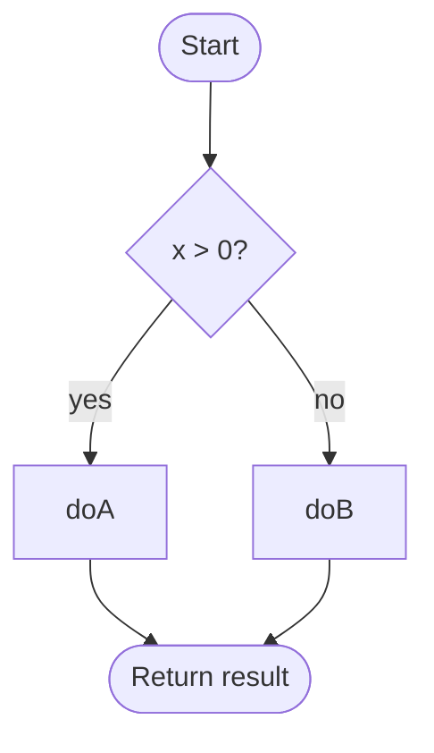
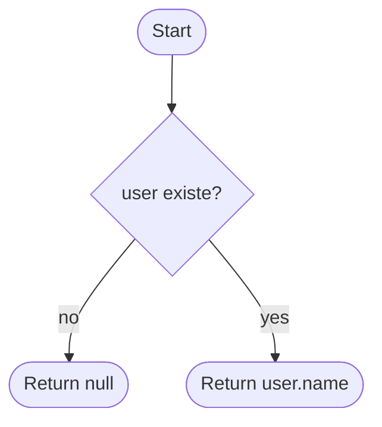
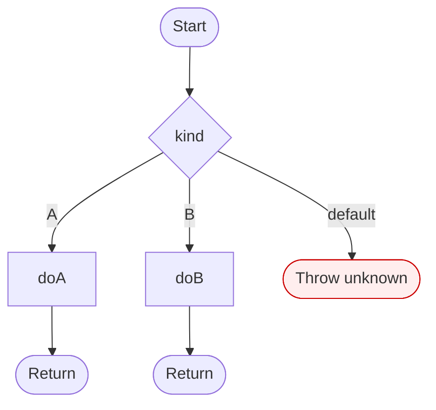
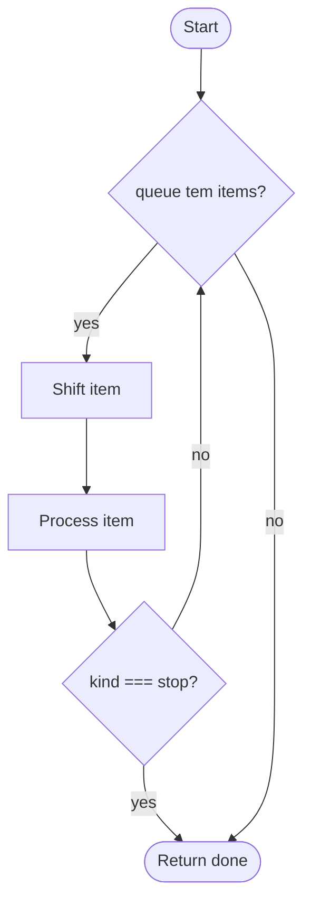
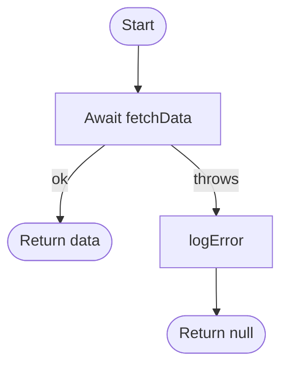
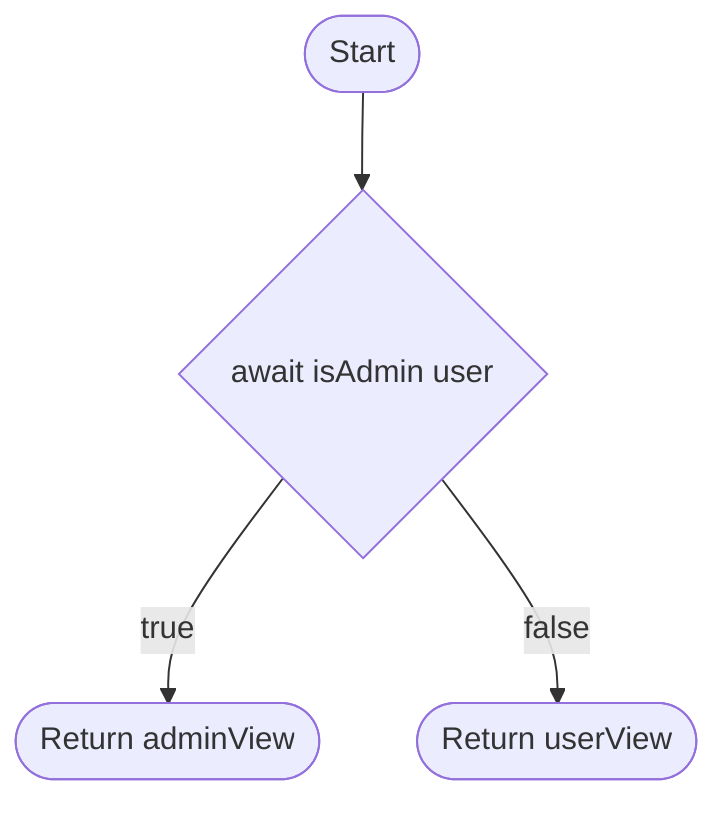
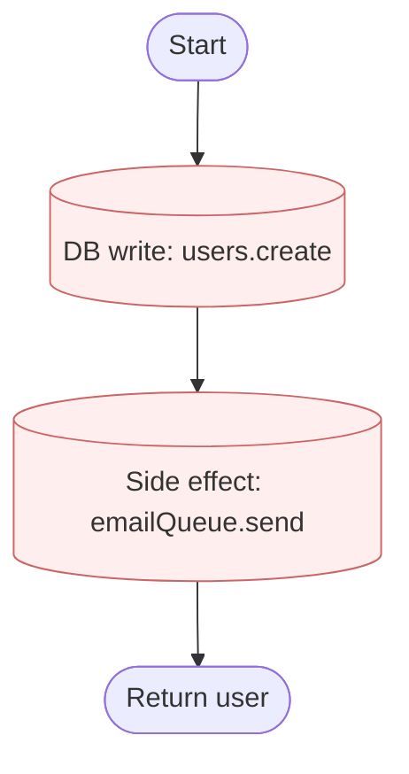

# Mermaid Patterns pra Fluxo de Controle

## if / else simples

```javascript
if (x > 0) {
  doA();
} else {
  doB();
}
return result;
```



## if sem else (early return)

```javascript
if (!user) {
  return null;
}
return user.name;
```



## switch / match

```javascript
switch (kind) {
  case 'A': return doA();
  case 'B': return doB();
  default: throw new Error('unknown');
}
```



## loop com condicao de saida

```javascript
while (queue.length) {
  const item = queue.shift();
  process(item);
  if (item.kind === 'stop') break;
}
return done;
```



## try / catch

```javascript
try {
  await fetchData();
} catch (err) {
  logError(err);
  return null;
}
return data;
```



## external state dependency

```javascript
if (await isAdmin(user)) {
  return adminView();
}
return userView();
```



## side effects (anotar como nota)

```javascript
await db.users.create(user);
await emailQueue.send(user.email);
return user;
```


